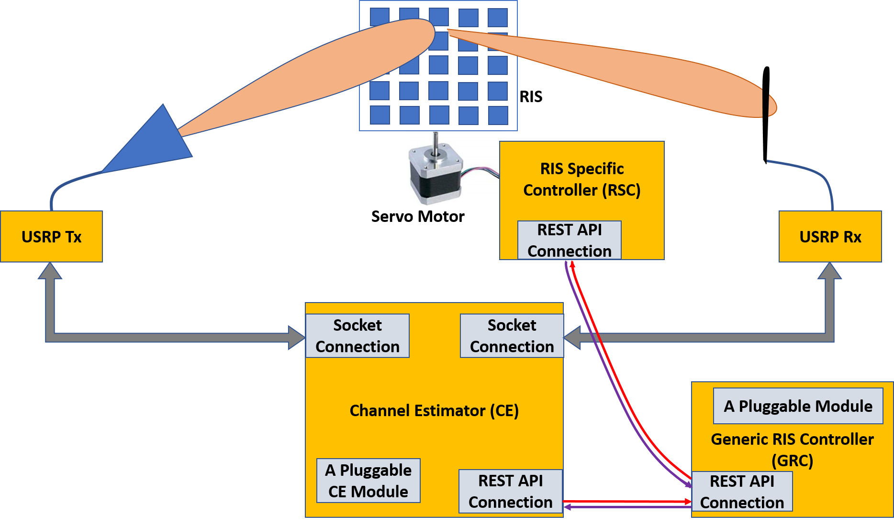
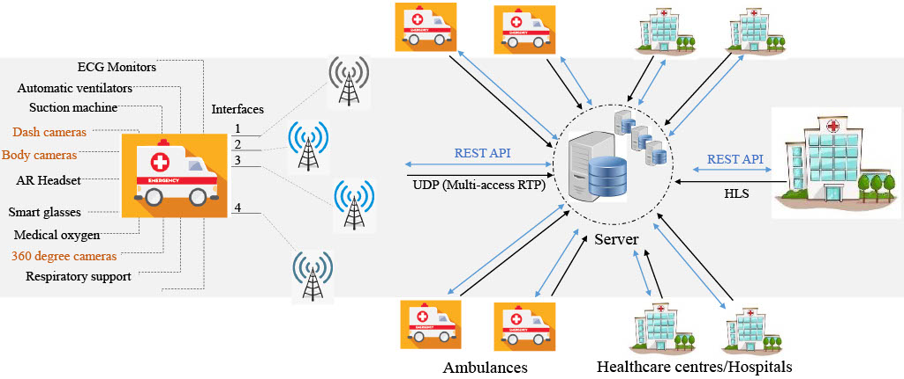

## About

 
Curious explorer with a persistent drive for innovation in Science and Technology. I bring a solid academic foundation in Computer Science Engineering and a Master's in Data Science and Artificial Intelligence. As a researcher, my journey has led me to dive into projects that span crafting intelligent 6G Communication solutions to leveraging Machine Learning models for real-world applications such as speaker identification and adaptive algorithms for innovative ambulance systems. With a toolkit that includes TensorFlow, PyTorch, and more, I thrive in collaborative environments, fostering interdisciplinary teamwork to create impactful solutions. 

## Education 
- **Master of Technology**, CSE, Specialization: DS&AI | *International Institute of Information Technology, Naya Raipur* _August 2019 - July 2021_
- **Bachelor of Engineering**, CSE | *Shri Shankaracharya Technical College, Bhilai* _August 2015 - July 2019_

## Research Experience
 **Junior Research Fellow** | Indian Institute of Technology, Bhilai \
   **Supervisor** : Dr. Arzad Alam Kherani | _November, 2022 - Present_ \
   **Project Title** : *Smart Radio Environments: Implementation And Deployment For Targeted Use-Cases.*\
   - Collaborating on Self-Supervised Learning models for wireless Channel Estimation.
   - Developed Autoencoder model, Flask REST APIs, service discovery protocol and participated in TSDSI \
     standardization for IRS-based 6G wireless communication [1].
   - Developed prototype of IRS with Channel Estimator and IRS Generic Controller [2].
   
  **Junior Research Fellow** | *Indian Institute of Technology, Bhilai*\
   **Supervisor :** Dr. Arzad Alam Kherani   |     _March, 2022 - October, 2022_\
   **Project Title:** *Massive Multi-Access to Provide UHD Quality Video And Real-time Data Delivery From 
     a Connected Mobile Ambulance And Its Extension To Other Disaster Recovery Scenarios.*
   - Contributed to system architecture, algorithm development, and prototype development of massive\
     multi-access Rpi setup to provide UHD video streaming [3].
   - Developed a public Flask API server with the hospital web application.

 **Master’s Thesis** | *Collaborated Govivace-Inc & IIIT NR*\
   **Supervisor:** Dr. Santosh Kumar       |  _September, 2020 - May, 2021_\
   **Project Title:** *Speaker Accent Identification Using The Time Delay Neural Network Architecture For The
   Indian Language.*
   - Developed the Time Delay Neural Network model to identify Indian speakers’ accents.
   - Collected data from participants and analyzed data using Kaldi and Tensorflow.

## Projects
**Title :** *Codebook Design and Autoencoder-based Codeword Selection for RIS-assisted Communications*

The one-bit beamforming codebook for Reconfigurable Intelligent Surfaces (RIS) is designed for an indoor environment. Each codeword in a codebook is a phase pattern at RIS elements that reflects the signal to a desired angle. Those codewords are computed for a specific reflection angle that maximizes the signal-to-noise ratio (SNR) at the receiver (RX). Since multiple codewords can maximize the SNR, an algorithm to reduce the size of the codebook is proposed. This ensures that the codebook does not contain repetitive codewords. In addition, after the codebook design, the codeword selection procedure is performed using an Autoencoder (AE) that minimizes the Bit Error Rate (BER) at the receiver. The proposed method shows promising results compared to existing techniques regarding BER with reduced codebook size.

**Title :** *TSDSI Standards Driven Implementation of Smart Radio Environment*

his paper presents a prototype implementation of an intelligent radio environment (SRE) based communication system. A
reflecting plate, a reconfigurable intelligent surface (RIS) is placed between the transmitter and receiver to build the SRE. The RIS
can rotate to reflect the incident wave in a particular direction. The experimental model consists of a channel estimator (CE),
a generic RIS controller (GRC), and a RIS-specific controller (RSC). The channel estimator is equipped with two USRP’s that
act as transmitter and receiver. Further, based on the desired throughput requirements, the CE sends commands to the GRC,
which in turn sends commands to the RSC that controls the RIS. Since a RIS can be designed and fabricated in many ways, a
TSDSI standard is in place to list the interface/messages between the wireless system and the RIS. These standardized commands
are used to exchange messages between the GRC and RSC. With this setup, the received power improvement of around 20 dBm has
been achieved if RIS is deployed. Also, an algorithm at GRC finds the beamforming angle where the received power is maximized.

**Title :** *Smart-ambulance: Services using Multiple Network Paths and Open APIs *

Nowadays, to enhance patient care and pre-hospital services, the healthcare and emergency response systems have
come together to provide immediate and timely treatment via smart ambulance services. These services are improving to match
the current healthcare requirements for patient care, which equally demand up-gradation at the hospital end for immediate
and speedy services. We first present a multi-access solution for streaming ultra-high definition video in the uplink from a mobile
system. We propose an application layer solution to intelligently split and distribute the video traffic among the multiple network
paths and interfaces and apply inter-stream coding for reliable transmission. The approach aims to enhance and control the end-
to-end delay jitter performance in multi-access. We then propose a standardized set of APIs to access the smart-ambulance services
(live data) for better utilization of the information, making the hospital system highly responsive and adaptable to the demand
of critical situations to enhance the (pre- and post-) healthcare system. We share the product-level implementation and real-
world results with a detailed explanation of front-end and back-end procedures to validate the proposed algorithms.

